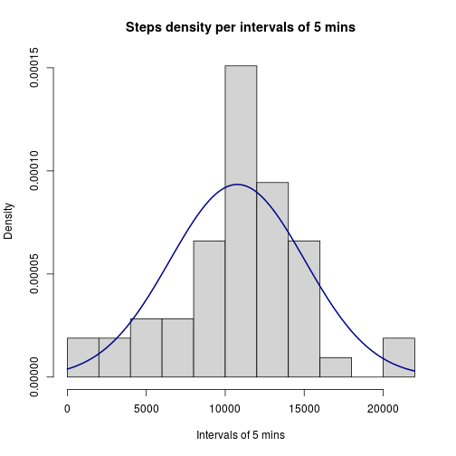
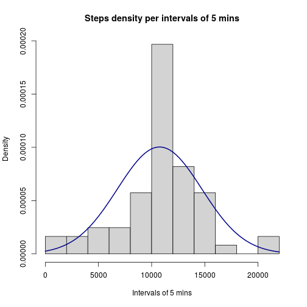
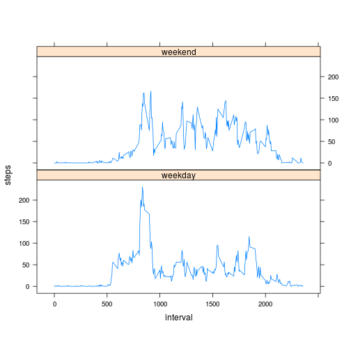

# Reproducible Research: Peer Assessment 1


## Loading and preprocessing the data
1. Load the data

*Firstly we add the datasets library, and after decompress the activity zip, we load the "activity.csv" file into a variable called rawact*

```r
library(datasets)
rawact<-read.csv("activity.csv")
```

2. Process/transform the data (if necessary) into a format suitable for your analysis

*In the preprocessing part, we create another variable called act that contains only the complete cases, avoiding the NAs of the steps column*

```r
cmpl<-complete.cases(rawact)
act<-rawact[cmpl,]
```


## What is mean total number of steps taken per day?
1. Make a histogram of the total number of steps taken each day

*The next plot shows an histogram of how many steps are in each interval for all the days, and over the histogram we plot the density curve that describes the steps data*

```r
actbydate<-aggregate(steps ~ date, act, sum)
Steps<-actbydate$steps
hist(Steps, breaks=11, freq=F,col="lightgrey",
     main="Steps density per intervals of 5 mins", xlab="Intervals of 5 mins")
curve(dnorm(x, mean=mean(Steps), sd=sd(Steps)), add=T, col="darkblue", lwd=2)
```

 

2. Calculate and report the **mean** and **median** total number of steps taken per day

*Exist the mean and median functions to obtain these values for the Steps dataset*

```r
mean(Steps)
```

```
## [1] 10766
```

```r
median(Steps)
```

```
## [1] 10765
```


## What is the average daily activity pattern?
1. Make a time series plot (i.e. type = "l") of the 5-minute interval (x-axis) and the average number of steps taken, averaged across all days (y-axis)

*We use the aggregate function to obtain the mean of steps for all the days at each interval of 5 mins, where "steps ~ interval" means that "steps" will be the y-axis dependent of "interval" in the x-axis, and the mean will be computed for "steps" in the dataset "act"*

```r
actbyinterval<-aggregate(steps ~ interval, act, mean)
plot(actbyinterval$interval, actbyinterval$steps, type="l",
     xlab="Interval of 5 mins",ylab="Average of daily steps",
     main="Averaged daily steps in 5 mins intervals")
```

 

2. Which 5-minute interval, on average across all the days in the dataset, contains the maximum number of steps?

*We retrieve the interval value of the row that contains the same value as the max value of all the steps column "max(actbyinterval$steps)"*

```r
actbyinterval[ actbyinterval$steps == max(actbyinterval$steps) , "interval"]
```

```
## [1] 835
```


## Imputing missing values
1. Calculate and report the total number of missing values in the dataset (i.e. the total number of rows with NAs)

*We already have a boolean vector for completed rows, so calculate the total missing row values is the same as the sum of the non-completed rows*

```r
sum(!cmpl)
```

```
## [1] 2304
```

2. Devise a strategy for filling in all of the missing values in the dataset. The strategy does not need to be sophisticated. For example, you could use the mean/median for that day, or the mean for that 5-minute interval, etc.

*The strategy that we follow is to assign for each missing value in steps, the average of steps for a given interval, hence whether the interval is "10" and the steps is "NA" we assign the precalculated average value for interval "10", e.g. 1.005 coerced to an integer value of 1.*

3. Create a new dataset that is equal to the original dataset but with the missing data filled in.

*The new dataset that we create with the previous strategy is the fillact variable.*

```r
intersteps<-split(actbyinterval$steps, actbyinterval$interval)
fillact<-rawact #New dataset
for (k in seq_along(fillact$steps)){
  if(is.na(fillact$steps[[k]])){
    fillact$steps[[k]]<-as.integer(intersteps[[toString(fillact$interval[[k]])]])
  }
}
```

4. Make a histogram of the total number of steps taken each day and Calculate and report the mean and median total number of steps taken per day. Do these values differ from the estimates from the first part of the assignment? What is the impact of imputing missing data on the estimates of the total daily number of steps?

*They differ a little, because we have inserted mean values in the NAs coerced to integers (rounded down), so we move the mean and median down of each value, and in the density function we give more relevance to values in middle than the previous histogram. We can appreciate how in the previous hist it reaches an 0.00015 value in y-axis, and in the current hist it reaches 0.00020 that is slightly higher.*

```r
fillbydate<-aggregate(steps ~ date, fillact, sum)
hist(fillbydate$steps, breaks=11, freq=F,col="lightgrey", 
     main="Steps density per intervals of 5 mins", xlab="Intervals of 5 mins")
curve(dnorm(x, mean=mean(fillbydate$steps), sd=sd(fillbydate$steps)), 
      add=T, col="darkblue", lwd=2)
```

 

```r
mean(fillbydate$steps)
```

```
## [1] 10750
```

```r
median(fillbydate$steps)
```

```
## [1] 10641
```

## Are there differences in activity patterns between weekdays and weekends?
1. Create a new factor variable in the dataset with two levels – “weekday” and “weekend” indicating whether a given date is a weekday or weekend day.

*The first thing we do is to set the local time to "C" to produce weekdays in English, because by default it produces the days in Spanish for our case. After that, we create a set weekend to check if the name of the day is in weekend or not, then we produce a boolean vector checking if all the days in the dataset fillact are weekends or not, and we follow using this boolean vector to create a new vector with all the True values to "weekend" and False values to "weekday". Once we have this vector we create a new factor variable with that vector, where the 2 levels are "weekday" and "weekend", and finally we bind this vector to the data table fillact as a new column and print the head info to check if it is ok.*

```r
library(data.table)
```

```
## data.table 1.9.2  For help type: help("data.table")
```

```r
Sys.setlocale("LC_TIME","C")
```

```
## [1] "C"
```

```r
weekend<-c("Saturday", "Sunday")
isweekend<-weekdays(as.POSIXlt(fillact[,"date"])) %in% weekend
weekdaytype<-apply(data.table(isweekend), 1, 
            function(x){ 
              if(x){return("weekend")} 
              else{return("weekday")}
            } )
factorweek<-factor(weekdaytype, levels=c("weekday","weekend"))
fillact<-cbind(fillact,factorweek)
head(fillact)
```

```
##   steps       date interval factorweek
## 1     1 2012-10-01        0    weekday
## 2     0 2012-10-01        5    weekday
## 3     0 2012-10-01       10    weekday
## 4     0 2012-10-01       15    weekday
## 5     0 2012-10-01       20    weekday
## 6     2 2012-10-01       25    weekday
```

2. Make a panel plot containing a time series plot (i.e. type = "l") of the 5-minute interval (x-axis) and the average number of steps taken, averaged across all weekday days or weekend days (y-axis).

*The last thing is to plot with xyplot function the averaged number of steps per interval divided into 2 charts, the first one for the weekdays type and the second one for the weekends type, and we create the variable compunting the mean of steps for a given interval and day type (factorweek variable).*

```r
library(lattice)
fillactbyinter<-aggregate(steps ~ interval + factorweek, data=fillact, mean)
xyplot(steps ~ interval | factorweek, data=fillactbyinter, type='l', aspect=0.4)
```

 
